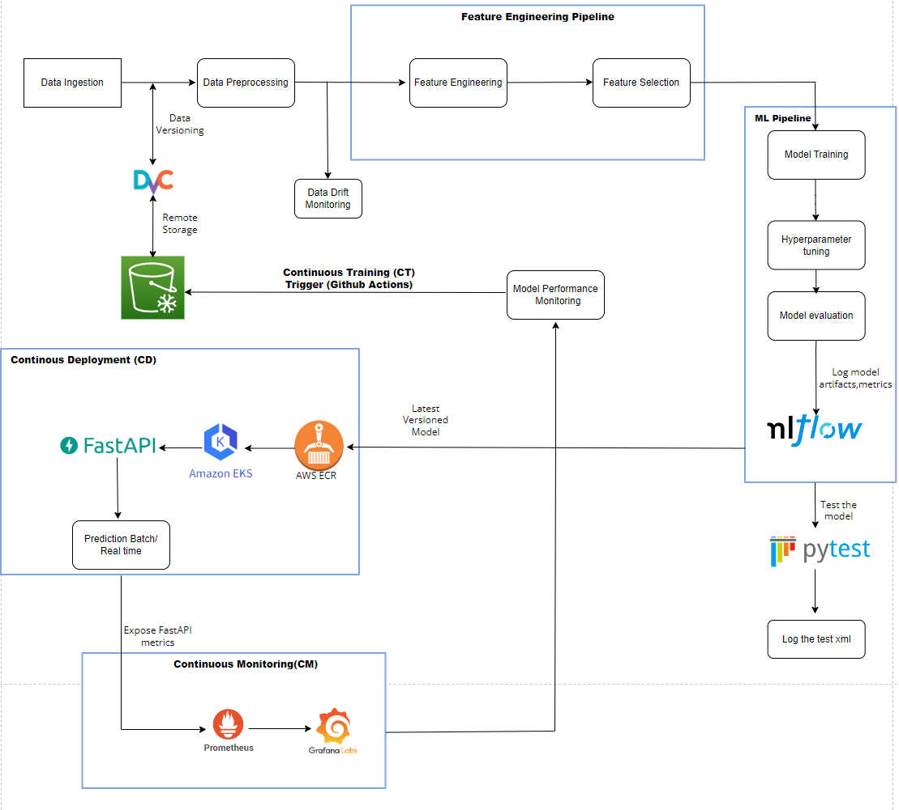
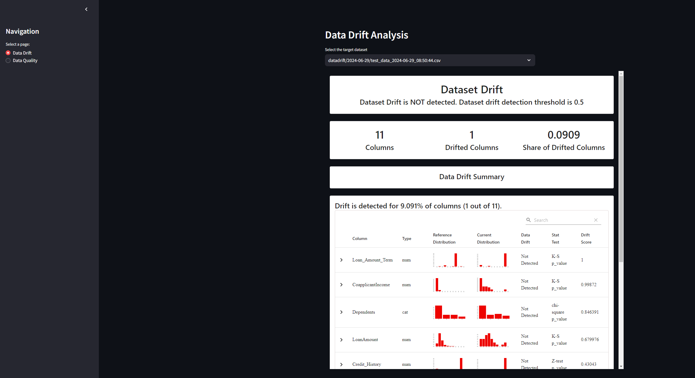
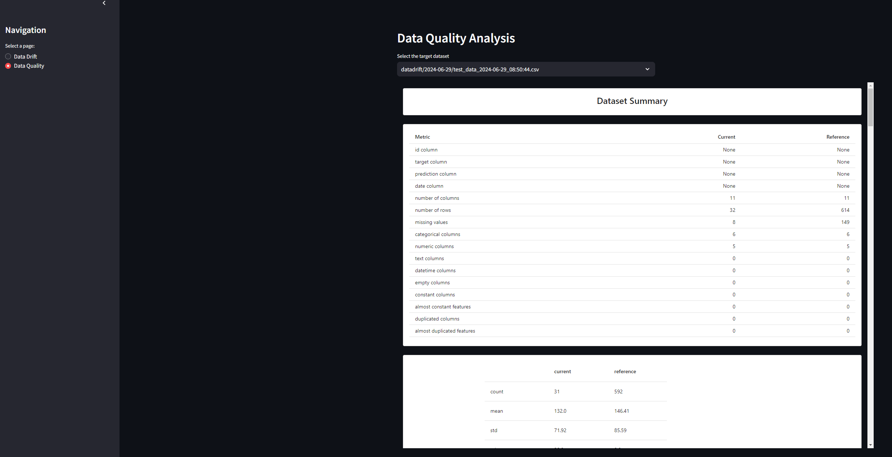
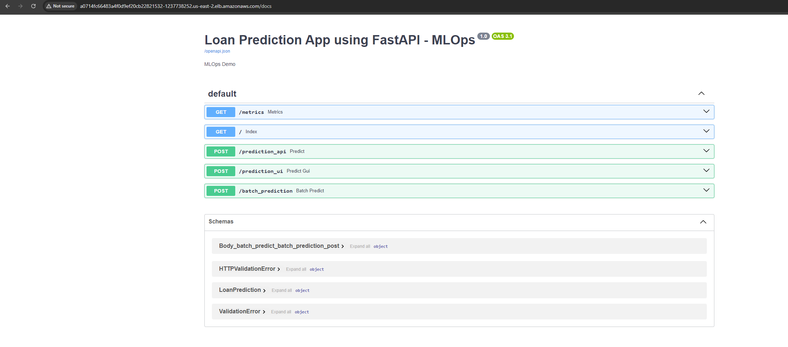
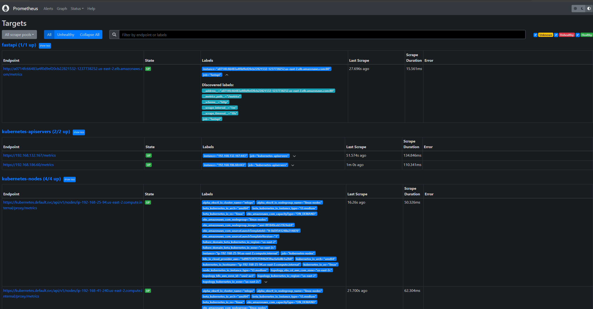
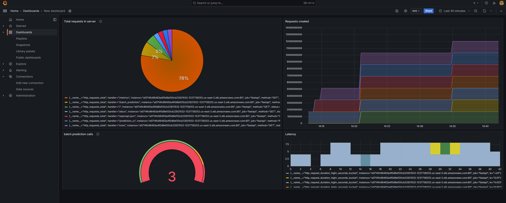
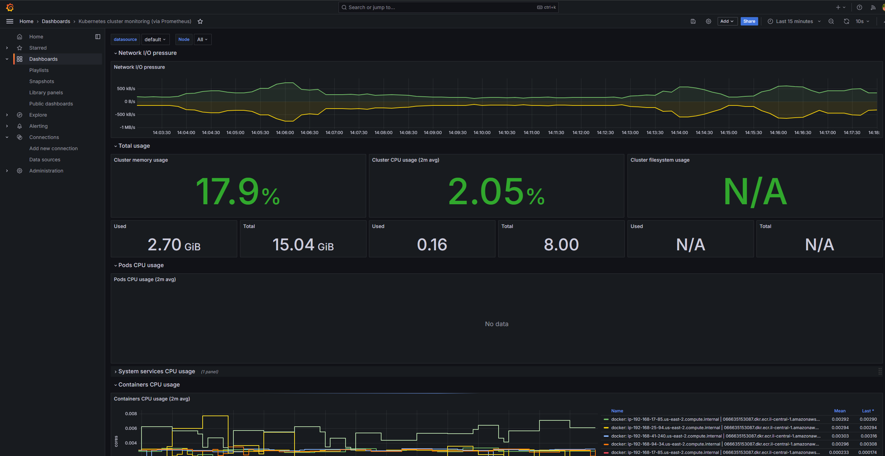

# Machine Learning Opearations (MLOps)

## MLOps maturity level 4

## Overview :
This project implements a robust MLOps pipeline, facilitating the continuous integration, continuous deployment, and monitoring of machine learning models. The infrastructure leverages AWS, Kubernetes, and various open-source tools to ensure scalability, reproducibility, and maintainability.

## Architecture :

## Key Features :

**Data Versioning** : DVC

**Continuous Integration(CI)** : Triggered through ‘main.yml’ , building the code (docker), tests the code(Pytest),pushes the docker image to AWS ECR. 

**Experiment Tracking / Model Versioning** : MLflow 

**Continuous Deployment(CD)** : Deploys FastAPI in AWS EKS(kubernetes cluster) for real-time and batch predictions. 

**Continuous Monitoring(CM)** : Integrating the ‘/metrics’ method of  FastAPI in Prometheus and visualizes endpoints in Grafana.  

**Continuous Training(CT)** : Triggers code execution through GitHub Actions when new data is pushed to the remote DVC location and committed to Git. 

**Drift Monitoring** : Uses a Streamlit app to monitor data drift, target drift, and performs data quality checks.

## Data Monitoring :

**Data Drift Monitoring** :

**Data Quality checks** :

## Continuous Monitoring(CM)

**Exposing "/metrics" on FastAPI to be connected to Prometheus** :

**FastAPI integrated in to Prometheus** :

**Integrating Prometheus in to Grafana for Visualization** :

Monitoring FastAPI methods on Grafana,

**Monitoring the resources of the Kubernetes cluster on Grafana** :

